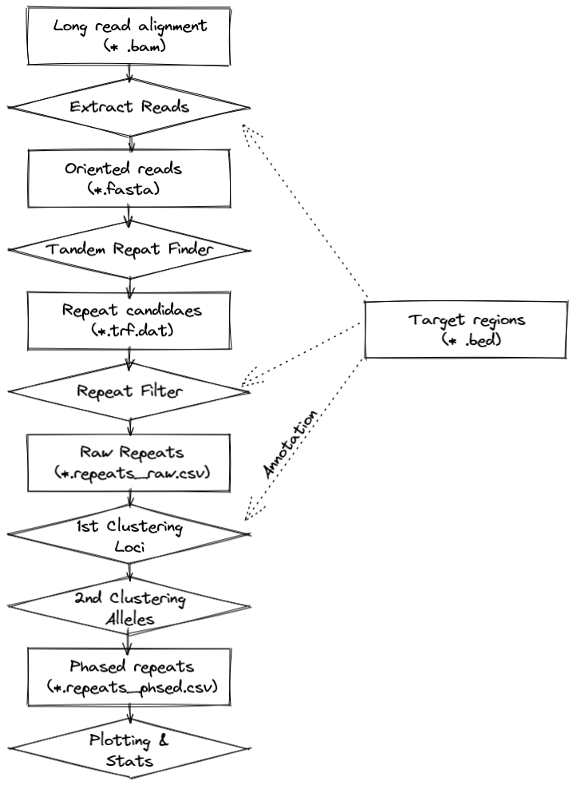

Expander: Repeat expansion analysis
------------------------------------

Expander runs repeat expansion analysis and characterisation steps on Nanopore and PacBio long reads.

# Development status

Still under active development and tailored to the data structure used in our institute. 

This pipeline has been tested with ONT and PacBio reads. De novo identification without target regions should work but probably takes very long.